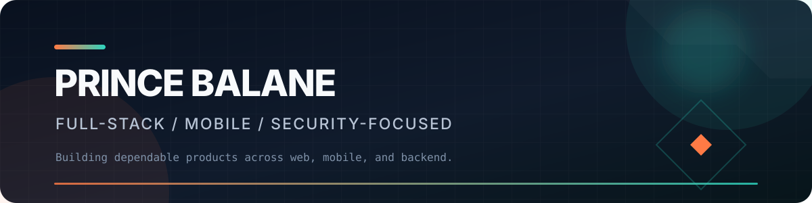

<div align="center">
  

  <br />

  <a href="mailto:princebalane19@gmail.com"></a>
  <a href="https://www.cozycraftfurnitures.com"></a>
  
</div>

## About me

I build full-stack web platforms and native-ready mobile apps with a strong focus on security, usability, and reliable business workflows. My recent work spans furniture commerce, HR operations, authentication and account recovery, real-time administration, and cross-platform mobile delivery.

- Building **CozyCraft Furnitures**, an end-to-end commerce ecosystem for web, iOS, and Android
- Designing role-based systems with Supabase Auth, PostgreSQL, Row Level Security, and server-side workflows
- Shipping security-conscious UX for payments, sessions, account recovery, notifications, and admin operations
- Working across product design, frontend architecture, backend integration, testing, and deployment

## Technology stack

<p>
  
  
  
  
</p>

<p>
  
  
  
  
  
  
</p>

<p>
  
  
  
  
  
</p>

<p>
  
  
  
  
  
  
  
  
</p>

<p>
  
  
  
  
</p>

## AI-assisted engineering

I use AI coding agents as engineering multipliers for codebase analysis, implementation, debugging, documentation, and review. Their output is treated as a proposal: changes stay grounded in requirements and source code, are inspected in Git, and must pass the relevant tests, builds, security checks, and human review before release.

<p>
  <a href="https://openai.com/codex/"></a>
  <a href="https://www.anthropic.com/claude-code"></a>
  <a href="https://opencode.ai/"></a>
  <a href="https://cursor.com/"></a>
  <a href="https://antigravity.google/"></a>
</p>

- Directing scoped agent tasks with explicit requirements, boundaries, and acceptance criteria
- Reviewing generated diffs instead of accepting opaque output
- Verifying behavior with type checks, automated tests, production builds, and browser QA
- Keeping credentials, production data, and privileged actions behind appropriate controls

## Featured work

| Project | What it demonstrates | Stack |
| :--- | :--- | :--- |
| [**CozyCraft Furnitures**](https://github.com/Imbatzyyy/CozyCraft-Furnitures) | Full commerce platform with customer and admin experiences, real-time operations, PayMongo checkout, and production deployment | React, TypeScript, Supabase, Tailwind CSS, Netlify |
| [**CozyCraft Mobile**](https://github.com/Imbatzyyy/CozyCraft-Furnitures-Mobile) | Native-ready customer application for Android and iOS with account security and notification flows | Angular, Ionic, Capacitor, React, Supabase |
| [**CozyCraft Admin App**](https://github.com/Imbatzyyy/CozyCraft-Furnitures-Admin-App) | Mobile operations workspace covering orders, catalog, customers, reports, support, and secure notifications | Angular, Ionic, Capacitor, Supabase |
| [**Quantum HRMS Security Dashboard**](https://github.com/Imbatzyyy/Quantumn-Art-Resources-Security-Dashboard) | Role-protected HR platform with security controls, accessible responsive portals, automated tests, and RLS-backed workflows | React 19, TypeScript, Supabase, Playwright, Vitest |
| [**Tutok Pitik Studios**](https://github.com/Imbatzyyy/Tutok-Pitik-Studios) | Photography studio platform with portfolio discovery, bookings, client accounts, favorites, administration, and server-side workflows | React, TypeScript, Supabase, Tailwind CSS, Netlify |

## Engineering focus

```text
Product engineering     Responsive experiences from workflow design to deployment
Security & identity     Auth, RLS, role separation, sessions, recovery, and audit trails
Cross-platform mobile   Angular + Ionic + Capacitor and Expo + React Native
Quality                 Type checking, unit tests, browser QA, accessibility, and release gates
```

## GitHub activity

<div align="center">
  
</div>

<div align="center">
  
  
</div>

<div align="center">
  <sub>Open to building thoughtful web and mobile products with dependable foundations.</sub>
</div>
